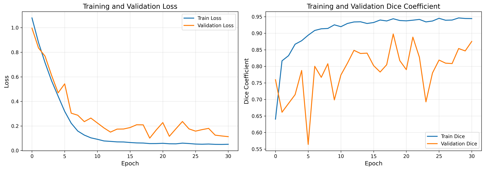
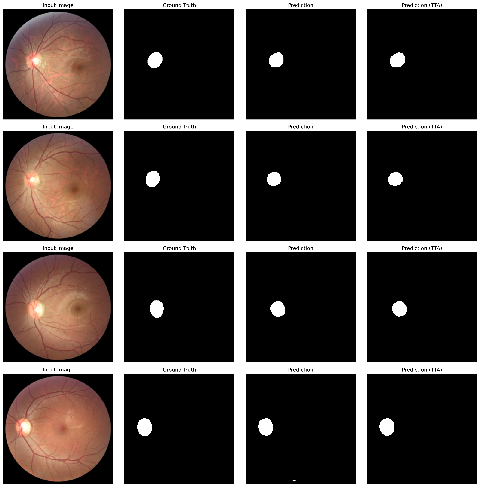

# Optic Disc Segmentation with Lightweight U-Net

## English

This project performs optic disc segmentation on retinal fundus images using a lightweight U-Net model with deep supervision. It was developed as an academic computer vision and medical image segmentation study.

### Overview

- **Task:** Binary optic disc segmentation
- **Dataset:** REFUGE2 retinal fundus images
- **Model:** Lightweight U-Net with approximately 483K parameters
- **Loss:** Binary Cross Entropy + Dice Loss
- **Techniques:** Deep supervision, data augmentation, test-time augmentation
- **Framework:** PyTorch

### Results

| Metric | Without TTA | With TTA |
| --- | ---: | ---: |
| Loss | 0.1033 | 0.0654 |
| Accuracy | 99.66% | 99.72% |
| IoU | 0.8342 | 0.8482 |
| Dice | 0.8994 | 0.9108 |
| Precision | 0.9349 | 0.9503 |
| Recall | 0.8878 | 0.8906 |

### Visual Results





### Project Structure

```text
.
|-- docs/
|   `-- OpticDiscSegmentationReport.pdf
|-- results/
|   |-- best_unet_improved.pth
|   |-- final_results.csv
|   |-- segmentation_examples.png
|   |-- training_curves.png
|   `-- training_history.csv
|-- train.py
|-- requirements.txt
`-- README.md
```

### Dataset Setup

The dataset is not included in this repository. Place the REFUGE2 dataset under the following structure:

```text
veriseti/
`-- refuge2/
    |-- train/
    |   |-- images/
    |   `-- mask/
    |-- val/
    |   |-- images/
    |   `-- mask/
    `-- test/
        |-- images/
        `-- mask/
```

### Installation

```bash
pip install -r requirements.txt
```

### Usage

```bash
python train.py
```

The script trains the model, evaluates it on the test set, and saves outputs under `model/runs/`.

### Report

A detailed project report is available here:

[Optic Disc Segmentation Report](docs/OpticDiscSegmentationReport.pdf)

---

## Turkce

Bu proje, retinal fundus goruntulerinde optic disc segmentasyonu yapmak icin deep supervision destekli hafif bir U-Net modeli kullanir. Calisma, bilgisayarli goru ve medikal goruntu segmentasyonu alaninda akademik bir proje olarak gelistirilmistir.

### Proje Ozeti

- **Gorev:** Binary optic disc segmentasyonu
- **Veri Seti:** REFUGE2 retinal fundus goruntuleri
- **Model:** Yaklasik 483K parametreli Lightweight U-Net
- **Loss:** Binary Cross Entropy + Dice Loss
- **Yontemler:** Deep supervision, veri artirma, test-time augmentation
- **Framework:** PyTorch

### Sonuclar

| Metrik | TTA Olmadan | TTA ile |
| --- | ---: | ---: |
| Loss | 0.1033 | 0.0654 |
| Accuracy | 99.66% | 99.72% |
| IoU | 0.8342 | 0.8482 |
| Dice | 0.8994 | 0.9108 |
| Precision | 0.9349 | 0.9503 |
| Recall | 0.8878 | 0.8906 |

### Gorsel Sonuclar


### Proje Yapisi

```text
.
|-- docs/
|   `-- OpticDiscSegmentationReport.pdf
|-- results/
|   |-- best_unet_improved.pth
|   |-- final_results.csv
|   |-- segmentation_examples.png
|   |-- training_curves.png
|   `-- training_history.csv
|-- train.py
|-- requirements.txt
`-- README.md
```

### Veri Seti Kurulumu

Veri seti bu repoya dahil edilmemistir. REFUGE2 veri setini asagidaki klasor yapisiyla yerlestirin:

```text
veriseti/
`-- refuge2/
    |-- train/
    |   |-- images/
    |   `-- mask/
    |-- val/
    |   |-- images/
    |   `-- mask/
    `-- test/
        |-- images/
        `-- mask/
```

### Kurulum

```bash
pip install -r requirements.txt
```

### Kullanim

```bash
python train.py
```

Script modeli egitir, test seti uzerinde degerlendirir ve ciktilari `model/runs/` klasorune kaydeder.

### Rapor

Detayli proje raporuna buradan ulasabilirsiniz:

[Optic Disc Segmentation Report](docs/OpticDiscSegmentationReport.pdf)

